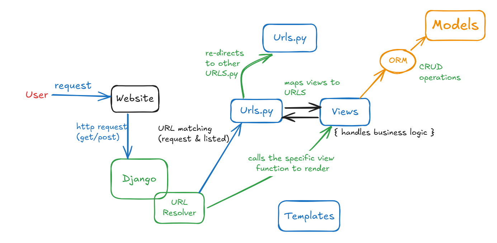

# Django_init

This repository consists of everything basics you need to know about Django and revise it whenever necessary.

## What is Django ?
 - high level Python framework that encourages rapid development and clean design.
 - known for simplicity
 - framework  that follows MVC architecutre _with aim to keep the business logic, data, and presentation separate, making the application easier to manage, develop, and scale_
 - Although, Django upgrades MVC by MVT (Model, view, template), _the controleer is replaces by Django framework itself._
 - provides tools and libraries for building webapps.
 - which includes built-in admin panel and ORM, templating engine.

## Django Important Terminologies:

 ### Views
 Views in Django are like the "brain" of your application. They take in user requests, process them (often involving querying the database), and return a response. Views can return different types of responses, such as HTML, JSON, or even an error message.

 ### Templates
 Templates are HTML files with placeholders for dynamic content. They determine how the content will be displayed to the user. Django uses a templating engine that allows you to embed Django Template Language (DTL) to add logic like loops and conditionals.
 _{{these are variables}}, these are templates _


 ### Model
 Models are the "blueprints" for your database. They define the structure of your data, specifying the fields and types of data you want to store. Models are Python classes that Django converts into database tables.

 ### ORMs
 Django ORM (Object-Relational Mapper) is a powerful feature of Django wherby it acts as a layer between the Django application and the database, that allows developers to interact with the database and manipulate data using Python code (objects and methods) instead of writing raw SQL queries.

 ### Templating Engine
 A templating engine is a system that processes templates—files containing static data like HTML mixed with special syntax for dynamic content (variables, loops, conditions). Django uses its built-in templating engine to render these templates into final HTML pages displayed to the user.
 It's primary purpose is to separate the presentation layer (UI) from the business logic in your Django applications.
 
 ### Basic Flow of Djnago
 

`User`--(request to website)--> `Django`---Url Resolver--`urls.py`--(may redirect to other urls)--`views.py`(main controller/logic here)--via or without model.py access db.


1. **User Request to Website (`User` -- request to website)**:
   - A user initiates a request by typing a URL in the browser or interacting with the website (e.g., clicking a link or submitting a form). This sends an HTTP request (like GET or POST) to the Django server.

2. **Django Receives the Request (`Django`)**:
   - Django's server (usually using `manage.py runserver` during development) receives the incoming request and starts processing it.

3. **URL Resolver (`---URL Resolver---`)**:
   - The URL Resolver is Django's component responsible for determining which view should handle the request based on the URL pattern. This step involves matching the request URL to patterns defined in `urls.py`.

4. **URL Patterns (`urls.py`)**:
   - `urls.py` is a configuration file where you define URL patterns and map them to specific views. Each pattern represents a route in your application. The URL Resolver checks these patterns to find the right view to call.
   - **Redirection to Other URLs**: Sometimes, `urls.py` may include nested URL configurations or redirects, which means requests can be forwarded to other `urls.py` files or endpoints within the project.

5. **Views (`views.py`)**:
   - Once the correct view is determined, Django calls the corresponding function or class defined in `views.py`. The view contains the main business logic or controller code for handling the request.
   - Views handle user input, interact with the database (if needed), perform calculations, and determine what data to send back to the user.
   - views may use templates.


6. **Access to Database via Models (`via or without model.py access db`)**:
   - **Via Model Access**: Views often interact with models defined in `models.py` to perform CRUD operations (Create, Read, Update, Delete) on the database. Models define the structure of the data, and Django's ORM (Object-Relational Mapper) allows the view to fetch or manipulate this data using Python code.
   - **Without Model Access**: Sometimes, views may not need to interact with the database directly. For example, a simple view that serves static content or redirects the user might not involve any database operations.


# Django Setup:

## Environment setup
- creating a virtual environment **In Windows**.
```
python -m venv .venv
```

**Can use uv to manage virtual environment faster**
```
pip install uv
```

- creating a virtual environment with uv
```
uv venv
```

- **to activate the virtual environment**
```
.venv\Scripts\activate
```
My personal error of prevention of running scripts.  
`Set-ExecutionPolicy RemoteSigned -Scope CurrentUser
`

- **To install Django finally with uv**
- to activate the virtual environment
```
uv pip install django
```


## Django Project Setup

### Django Project:

 - A Django project is a collection of settings and configurations that define the structure and behavior of a web application.

 - It includes the code for the application, as well as the templates, static files, and other resources that make up the application.

 ### To create a new Django Project

 ```
 django-admin startproject ProjectName
 ```
 ### Start a Django Server
 
 ```
 python manage.py runserver
 ```
 - This will start the server at _http://localhost:8000_

### Then configure static and media files 

 ## File Structure
 ```
  myproject/
│
├── myproject/
│   ├── __init__.py
│   ├── settings.py
│   ├── urls.py
│   ├── wsgi.py
│   ├── asgi.py
│
├── manage.py
├── db.sqlite3
```
  

### 1. `myproject/` (Outer Directory)
- This is the root directory of your Django project. It contains the main project folder, the database file, and the manage.py script.

### 2. `myproject/` (Inner Directory)
- This inner folder shares the same name as your project and contains the core settings and configuration files of the Django project.

### 3. `__init__.py`
- **Purpose**: Marks the directory as a Python package. It can be empty but is essential for Python to recognize the directory as a module.
- **Importance**: It allows you to import modules from this package, enabling Django to function correctly.

### 4. `settings.py`
- **Purpose**: This file contains all the configurations for your Django project, such as database settings, installed apps, middleware, static files, templates, and more.
- **Importance**: It acts as the central place for managing project settings, making it crucial for controlling how your Django project behaves.

### 5. `urls.py`
- **Purpose**: Defines the URL patterns for your project and routes incoming requests to the appropriate views.
- **Importance**: Acts as the URL router, directing traffic to the correct parts of your application based on the request URL.

### 6. `wsgi.py`
- **Purpose**: Stands for Web Server Gateway Interface. It helps your project serve web requests and is used when deploying Django with servers like Gunicorn or Apache.
- **Importance**: Acts as the entry point for WSGI-compatible web servers to serve your Django application.

### 7. `asgi.py`
- **Purpose**: Stands for Asynchronous Server Gateway Interface. It's used to handle asynchronous web requests and is particularly useful for real-time applications, such as chat apps.
- **Importance**: Allows Django to interact with ASGI servers like Daphne or Uvicorn, enabling support for WebSockets and other asynchronous protocols.

### 8. `manage.py`
- **Purpose**: A command-line utility that helps manage the Django project. It allows you to run commands like starting the server, migrating the database, creating apps, and more.
- **Importance**: Essential for performing various administrative tasks within your Django project.

### 9. `db.sqlite3`
- **Purpose**: The default SQLite database file where all your project's data (like user information, posts, etc.) is stored.
- **Importance**: Acts as the backend storage system for your application’s data during development or for smaller projects.

---

These files and directories together form the backbone of your Django project, handling configuration, routing, database management, and server interaction, allowing you to develop, test, and deploy your application effectively.

 

# Creating an Django app

## Django App
 - modular components of a Django project that are designed to handle specific functionalities or features within the application. 

 - Each app is a self-contained package of code that can include models, views, templates, static files, and other components that work together to provide a particular functionality.
 
```
python manage.py startapp _appName
```

After creating an app next we have to do is make the project aware of the app.

- Inside `settings.py` add `appName` inside installed apps.
 ```
  INSTALLED_APPS = [
    .....
    'appName',
  ]
  ```

- Form folder `template/newApp` inside the new App.
1. Here write the html to be rendered,
give its reference to views then.
2. Copy urls from original projects url.py to `newApp`'s newly formed `url.py`
_This is URL.py refereing to subURL.py in Django_
_Then pass the control from original URL.py to subURL_


## Django app structure
```
 myproject/
│
├── myproject/
│   ├── __init__.py
│   ├── settings.py
│   ├── urls.py
│   ├── wsgi.py
│   ├── asgi.py
│
├── myapp/
│   ├── migrations/
│   ├── __init__.py
│   ├── admin.py
│   ├── apps.py
│   ├── models.py
│   ├── serializers.py
│   ├── views.py `contains API views`
│   ├── urls.py  `contains URL patterns for API endpoints`
│   ├── tests.py
│
├── templates/
│   ├── myapp/
│       ├── index.html
│       ├── about.html
│       ├── contact.html
│
├── manage.py
├── db.sqlite3
 ``` 


### 1. `myapp/`
- This directory represents a Django app within your project. Each app is a self-contained module that handles a specific aspect of the overall project, like handling APIs, managing data models, or defining views.

### 2. `migrations/`
- **Purpose**: Contains migration files that track changes to your app’s models (database schema).
- **Importance**: Used by Django to apply changes to the database, such as creating tables, altering fields, and managing schema versions.

### 3. `__init__.py`
- **Purpose**: Marks the directory as a Python package. It's usually empty.
- **Importance**: Required for Python to recognize the app directory as a module, enabling import statements.

### 4. `admin.py`
- **Purpose**: Registers models with Django’s admin interface, allowing you to manage app data through a web-based UI.
- **Importance**: Facilitates easy data management and testing through the built-in Django admin panel.

### 5. `apps.py`
- **Purpose**: Configures app-specific settings and metadata.
- **Importance**: Defines the app’s configuration class, which is referenced in the project’s `settings.py` to include the app.

### 6. `models.py`
- **Purpose**: Defines the data models (tables) for the app. Each class represents a database table with fields mapping to columns.
- **Importance**: Central to the app’s data structure, allowing you to define and manipulate data in the database.

### 7. `serializers.py`
- **Purpose**: Defines serializers to convert complex data types like querysets and model instances into JSON, XML, or other formats, and vice versa.
- **Importance**: Essential for creating APIs, as it helps translate data between models and external representations for APIs.

### 8. `views.py`
- **Purpose**: Contains the business logic and API views that handle requests, interact with models, and return responses.
- **Importance**: Core of the app’s functionality, managing how data is processed and presented to the user or API client.

### 9. `urls.py`
- **Purpose**: Defines URL patterns specific to this app, mapping each URL to a corresponding view function or class.
- **Importance**: Routes incoming requests to the appropriate view, keeping URL configurations organized and modular.

### 10. `tests.py`
- **Purpose**: Contains unit tests for the app, ensuring that the code works as expected.
- **Importance**: Crucial for maintaining code quality, catching bugs early, and ensuring the app’s reliability.

---

This app structure allows you to organize code efficiently, keeping related functionality within the app modular and maintainable, facilitating a clean separation of concerns within your Django project.


Jinja2- templating engine.

Templating ?
-ek palta base structure banaisakepaxi tyo sabai thau bhayeko ramro, that's templating
for eg navbar is same for multipages

# Adding Tailwind CSS in Django


Installing tailwind via uv directly (if it works)
```
uv pip install django-tailwind
uv pip install 'django-tailwind[reload]'
```

If not try :
Initially installing pip for reduced errors, try any one of 2 methods:
```
python -m ensurepip --upgrade 
python -m pip install --upgrade pip
```

Then install tailwind via pip : 
```
pip install django-tailwind
pip install 'django-tailwind[reload]'
```
settings.py ma gayera application ma 'taiwind' thapne

`python manage.py tailwind init`
This will download some packages and form new folder which you have to give _newname_

in settings.py:
**installed_apps =[]** ma : _tailwind_ thapne
also add :
- **TAILWIND_APP_NAME:** _'newname'_
- **INTERNAL IPS: ['']**   
i.e array and string inside and 
- **NPM_BIN_PATH:** _r"C:\Program Files\nodejs\npm.cmd"_  
to generate this `from where npm` in cmd : _r"path"_

`python manage.py tailwind install`

- In template base html page add 
```

...
<head>
   ...
  
 ...
</head>
```

Tailwind ko lagi naya terminal banaune
`python manage.py tailwind start`

- You may need to restart app because you have not yet configured hot reloading.

### Hot reloading 
Hot reload (or hot reloading) is a feature commonly used in web development that allows developers to see changes to their code in real-time without needing to restart the development server or refresh the browser manually.

 Since we have already installed the `django-tailwind[reload]` package, we can use the tailwind-django command to enable hot reloading in our project.

Add it to your _INSTALLED_APPS_ in your _settings.py_ file:

```
INSTALLED_APPS = [
    # ...
    'django_browser_reload',
    #...
]
```

_Now hot reloading is possible_.

# Rendering HTML in Django : Dev POV

## Define and create templates
Define HTML structures and relevant CSS or JS 
and enclose it inside templates directory.
_Say your HTMl document is **index.html**_

## Create Views 
- In django views handle both presentation and business logics.

```
from django.shortcuts import render

def app_views(request):
  return render(request, 'newApp/index.html', 
```
Here,
1. **render** function that simplifies the process of generating an HTTP response with a rendered template is imported.

2. **app_views(request)** defines view function, with parameter request, _which represents HTTP request of client_ 

3.  Calling **render function**: it combines the request with a specified template and returns an HTTP response with the rendered template.
The return value is _HTTPResponse_ object which will be sent back to client browser.

## Map views in urls.py
```
from django.urls import path
from . import views

urlpatterns = [
    path('', views.app_views, name='index'),
]

```
To include URL patterns defined in myapp/urls.py in the project’s URL configuration.`include('tweet.urls')),`
```
from django.urls import path,include #---include import too

urlpatterns = [
    path('admin/', admin.site.urls),
    path('tweet/', include('tweet.urls')),
] 
```

# Django Admin Panel

in case you forget password :
`python manage.py changepassword userName`

# Django Models and working with Django ORM
- Django Models are heart of Django application, used to define the structure of database and relationship between different models.
- Model is a python class that represents table in db.  
- It contains fields that define structure of table i.e. attributes and methods that define the behaviour of table.

- Usually data related files/models are not created/handled in main project.
i.e so inside the app.

## Fields and Field options of Model:
- They are attributes of model class that define column of db table
- The various field types include `CharField, IntegerField, DataField, BooleanField`
- Each filed takes certain set of field-specific arguments like `maxlength, null, blank, default, choices` which are known as field arguments. 

## Defining a model
use models.py file in Django project
```
from django.db import models
from django.utils import timezone

# Creation of model
class modelName_Book(models.Model):

  field1_bname= models.CharField(max_length=200)
  field2_author=models.CharField(max_length=100)
  field3_dateofpub=models.DateField()
  feild4_imagepp= models.ImageField(upload_to='media/')
```
- `.Model`: The base class that turns a Python class into a database table with fields as columns, enabling easy database operations.

#### Note : Install Pillow library to use image field

when you want to put images or use image field you have to do changes in settings.py of project.

```
MEDIA_URL = '/media/'
MEDIA_ROOT = os.path.join(BASE_DIR, 'media')
```
For static files
```
STATIC_URL ='static/'
STATICFILES_DIRS = [ os.path.join(BASE_DIR , 'static')]
```
then to reflect media files configure in main project's urls.py
```
from django.conf import settings
from django.conf.urls.static import static
```

```
urlpatterns = [
    path('admin/', admin.site.urls),
    #...
    #...
] + static(settings.MEDIA_URL, document_root=settings.MEDIA_ROOT)
```

## Adding data to DB : Database Migrations

- The django doesnt yet know we have added a new model so letting it know
via migrations i.e. keeping your database schema in sync with Django models.

### How to migrate ?
 To create or modify a model, you need to create a migration file which contains the instructions on how to alter the database schema to reflect the changes in your models.

 - They are like Version control system, allowing _apply, rollback and manage changes_.

 1. Creating migrations file by using `makemigration` command.
  _files like 0001-add.py_
```
python manage.py makemigrations chai
```

2. Applying migrations by `migrate` command to modify necessary tables and fields.
```
python manage.py migrate
```

- Now to add some data to DB.
Admin.py sanga kunai pani model attach garera admin panel ma herna milxa
For this goto admin.py and add following code to `userModel`
```
from django.contrib import admin
...
from .models import modelName

admin.site.register(modelName)
```

## CRUD opertions
- CRUD stands for Create, Read, Update, and Delete. These are the four basic operations you can perform on data in a database.

- Django's ORM provides an easy and intuitive way to perform these operations using model methods and querysets.
### 1. Create
- To create new instance of model i.e add new record.
```
new_book = Book.objects.create(bname="Django for Beginners", author="John Doe", dateofpub="2024-01-01")
```

### 2. Read
- To retrieve data from DB, 
- Methods : 
- all(): Retrieves all records.
- filter(): Retrieves records matching certain conditions.
- get(): Retrieves a single record matching a condition

```
# Retrieve all books
all_books = Book.objects.all()

# Retrieve books published by "John Doe"
john_books = Book.objects.filter(author="John Doe")

# Retrieve a single book by its ID
single_book = Book.objects.get(id=1)

```

### 3. Update
```
# Retrieve a book instance
book_to_update = Book.objects.get(id=1)

# Update fields
book_to_update.title = "Advanced Django"
book_to_update.save()

```

### 4. Delete
```
# Retrieve a book instance
book_to_delete = Book.objects.get(id=1)

# Delete the instance
book_to_delete.delete()

```

## Model Relationships
- Model relationships in Django define how different models (database tables) relate to each other. 
- This includes relationships like one-to-one, one-to-many, and many-to-many.
- It allows you to create complex data structures and maintain associations between different entities in application

### One to One Relationship
- To represent one to one relationship between 2 models.
- Each record in one model is related to exactly one record in another model.
- _Each author has only 1 profile in below eg_

```
class Author(models.Model):
    name = models.CharField(max_length=100)
    bio = models.TextField()

class Profile(models.Model):
    author = models.OneToOneField(Author, on_delete=models.CASCADE)
    website = models.URLField()
```

### Many to One Relationship
To represent a many-to-one relationship where multiple records in one model are associated with a single record in another model.

```class Book(models.Model):
    title = models.CharField(max_length=200)
    author = models.ForeignKey(Author, on_delete=models.CASCADE)
```
- Here each book can be associated with one Author
- The author field is used as ForeignKey pointed to Author model
- `on_delete=models.CASCADE`: When an Author is deleted, all associated Book instances are also deleted.

### Many to Many Relationship
to Represent a many-to-many relationship where multiple records in one model can be related to multiple records in another model.

```
class Genre(models.Model):
    name = models.CharField(max_length=100)

class Book(models.Model):
    title = models.CharField(max_length=200)
    genres = models.ManyToManyField(Genre)
```
A Book can belong to multiple Genres, and a Genre can include multiple Books.

# Reflection of DB in Frontend i.e views 

in views.py file 
add new parameter in `return render ()` after extracting the value from DB in variable
```
from django.shortcuts import render

def app_views(request):
  dbData = user_Model.objects.all()
  return render(request, 'newApp/myNewApp.html', {'dbData': dbData})
```
In the template, you can access the dbData variable to display the data retrieved from the database.

# Django Forms
- way to handle user input in structured way,
- make it easy to create, validate, and process forms
- **major uses** : automatic validation, protects against XSS, convinience to create forms based on Model fields (modelForm)
- **Types of Forms:**
1. Forms : basic, manually defined and specified
2. ModelForms : automatically created from DjangoModels.

## Basic Overview :
- create `forms.py`
- render form from HTML template
- process : handle submission in view, check validity and save data

**NOTE**: crsf token is used to prevent cross-site forgery.
